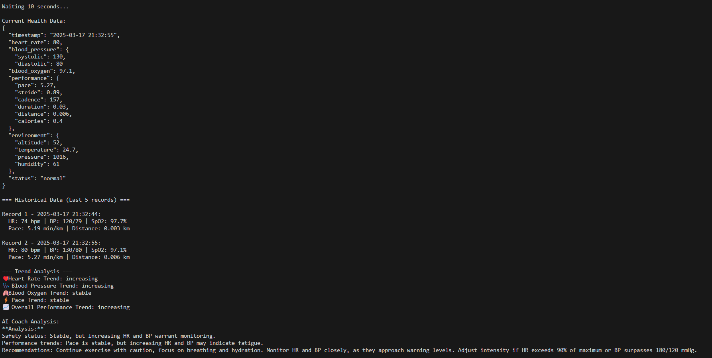
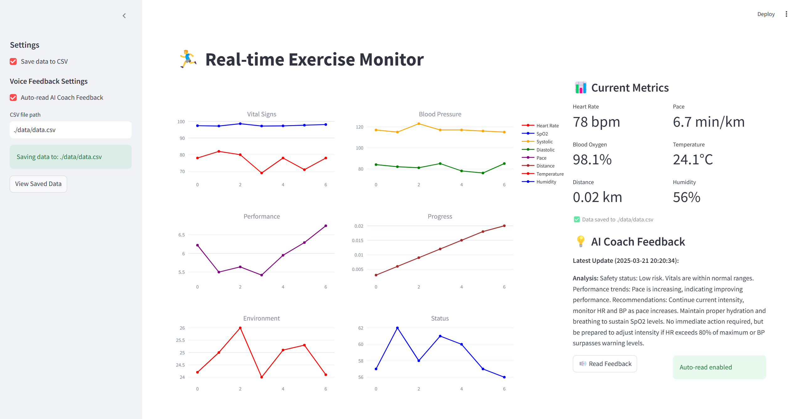
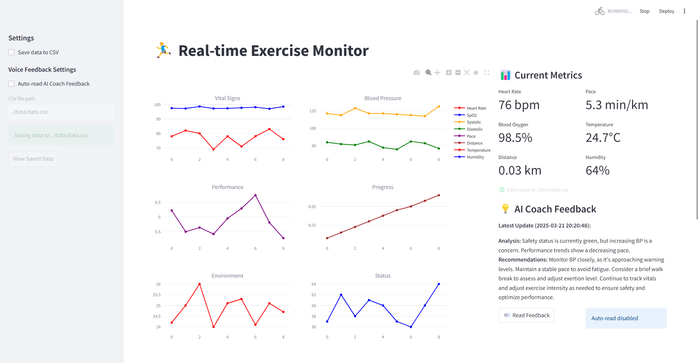

# AI Coach: Real-time Performance Analysis Using Wearable Sensors and LLM

### You can find **tutorial** [here](tutorial.md)

## Setup
1. **SambaNova Cloud API Configuration**:
   - Register for a SambaNova account at [cloud.sambanova.ai](https://cloud.sambanova.ai/apis)
   - Navigate to the API section and generate your personal API key
   - Store this key securely as it will be needed for LLM integration

2. **Python Environment Setup**:
  ```
  # Create and activate a new conda environment
  conda create -n AIcoach python=3.9.20
  conda activate AIcoach
   
  # Install required packages
  pip install -r requirements.txt
  ```

3. **Environment Variables Configuration**
  ```
  # Copy the example configuration file
  cp .env.example .env

  # Edit the .env file and add your SambaNova API key
  # SAMBANOVA_API_KEY="your-key-here"
  ```

## Demonstration
Our AI Coach system can be run in two modes:
- For headless or debugging purposes, the system can operate in terminal mode:
  ```
  python main.py --mode terminal
  ```
  In this mode, exercise data and AI feedback are displayed in the console, allowing for lightweight monitoring.
  

- For a complete interactive experience, the UI mode provides comprehensive visualization and control: 
  ```
  python main.py --mode ui
  ```
  The UI mode features:
  - Real-time multi-panel charts
  - AI feedback display
  - Voice output controls
  - Settings configuration panel
  
  

  

[SambaNova Cloud API]:https://cloud.sambanova.ai/apis