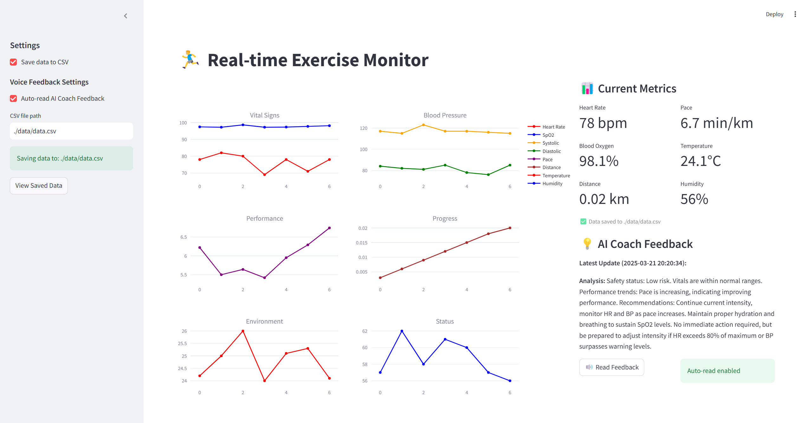

# AI Coach Tutorial: Real-time Performance Analysis Using Wearable Sensors and LLM

*   **Jiang Feiyu** <3035770800>
*   **Wu Jiaux** <3036410330>
*   [Github Link](https://github.com/Jiang-Feiyu/AI_Coach_Tutorial#)

## **Introduction**

The rapid advancement of wearable sensor technology and AI-powered analytics has revolutionized personalized fitness coaching. However, real-time performance optimization for runners remains a challenge due to the lack of integrated systems that combine physiological monitoring, intelligent analysis, and interactive feedback. This tutorial introduces a practical approach to building an AI-powered running coach that leverages wearable sensors (such as an Apple Watch) and LLM. The system is designed to continuously monitor key physiological metrics—including heart rate and blood oxygen levels and analyze them in real time to provide actionable insights. By integrating AI-driven performance assessment with voice-based coaching delivered through Bluetooth earbuds, the solution aims to enhance training efficiency and adaptability. The primary goals include developing a scalable data processing pipeline, optimizing personalized training recommendations, and enabling seamless human-AI interaction through natural language interfaces.

<div STYLE="page-break-after: always;"></div>

## **Prerequisites**

1.  **SambaNova Cloud API Configuration**:
    *   Register for a SambaNova account at [cloud.sambanova.ai](https://cloud.sambanova.ai/apis)
    *   Navigate to the API section and generate your personal API key
    *   Store this key securely as it will be needed for LLM integration

2.  **Clone from Github**
    
    `git clone https://github.com/Jiang-Feiyu/AI_Coach.git`

3.  **Python Environment Setup**:
    ```
        # Create and activate a new conda environment
        conda create -n AIcoach python=3.9.20
        conda activate AIcoach
        # Install required packages
        pip install -r requirements.txt
    ```
4.  **Environment Variables Configuration**
    ``` # Copy the example configuration file
        cp .env.example .env

        # Edit the .env file and add your SambaNova API key
        # SAMBANOVA_API_KEY="your-key-here"
        # You can customize the system prompt and user prompt 
        # by modifying the SYSTEM_MESSAGE and EXERCISE_ANALYSIS_TEMPLATE.
    ```
5.  **Prerequisites Knowledge**

*   **Technical Knowledge**:
    *   Python programming fundamentals
    *   API fundamentals (REST, HTTP requests, authentication)
    *   Basic data handling (JSON, CSV operations)

*   **Health & Fitness Knowledge**:
    *   Understanding of physiological metrics
    *   Knowledge of heart rate zones
    *   Basic comprehension of fatigue indicators

*   **Hardware Requirements** (not mandatory,this tutorial provides a method to simulate data for exploration)

    
<div STYLE="page-break-after: always;"></div>

## **Step-by-Step Guide**

Here is the structure of the project.


    │  .env
    │  .env.example
    │  data_storage.py
    │  fetch_llm.py
    │  main.py
    │  README.md
    │  terminal.py
    │  tutorial.md
    │  ui.py
    ├─data
    └─img

*   `terminal.py`: Generates exercise data. (if you have a terminal device, you can rewrite the function to collect exercise data according to your needs, but you need to check the corresponding device documentation)
*   `fetch_llm.py`: Interface with LLM API. You can adjust model output by changing prompt environment variables in `.env`.
*   `ui.py`: Creates frontend UI, displays real-time dynamic data and model suggestions, with text-to-speech functionality.
*   `data_storage.py`: Saves historical data in .csv format under `./data` directory.
*   `main.py`: Main function. Implements program functionality by calling other modules. Provides two running modes: UI view and terminal mode (headless).

<div STYLE="page-break-after: always;"></div>

### Task 1: Add features to the simulator!

Open with `terminal.py`

*   Add input validation to ensure the generated data stays within realistic ranges.

```
    def validate_health_data(self, data):
        """
        Validate health data is within acceptable ranges
        Returns: (is_valid, message)
        """
        if not (40 <= data["heart_rate"] <= 200):
            ...
        # ============================================================
        # Add your code here 
        # more validation rules
        # ============================================================
        return True, "Data valid"
```

*   Create a method that simulates a complete workout session with different phase

```
    def simulate_workout_session(self, workout_plan):
        """
        workout_plan example:
        [
            ("warmup", 5),      # 5 minutes warmup
            ...
        ]
        """
        # ============================================================
        # Add your code here 
        # Create a method that simulates a complete workout session with different phases
        # ============================================================
        pass
```

*   Beyond modifying this function, you'll need to correspondingly update the data structures and control flow. This enhancement makes the data stream more realistic and aligned with actual exercise patterns. 

<div STYLE="page-break-after: always;"></div>

### Task 2: Data Management

During the program process, loads of data may need to be handled. So a good data management system is significant. Open with `data_storage.py`:

*   File mamagement

```
    def manage_file_rotation(csv_path, max_size_mb=10):
            # ==========================================================
            # Add your code here 
            # Task2 : File Management
            # Modify your code here to:
            # - Implement file rotation based on size or date
            # - Add backup functionality
            # - Check and manage file size
            # ==========================================================
            pass
```

A good data management can ensure data integrity, optimize system performance, and facilitate efficient data analysis while maintaining long-term operational sustainability.

<div STYLE="page-break-after: always;"></div>

### Task 3: Generate Personalized Suggestion

Open with `fetch_llm.py`:

*   Implement a system that generates personalized exercise recommendations based on workout data, trends, and user profile.
*   There is not limitation for you to modify specific function, you can explore whatever you want! Here is an example for you to reference:

```
    def generate_exercise_recommendations(current_data, trends, user_profile=None):
        """
        Generate personalized exercise recommendations
        
        Args:
            current_data (dict): Current workout data (heart rate, blood pressure, etc.)
            trends (dict): Historical trend analysis
            user_profile (dict, optional): User's fitness profile
            
        Returns:
            dict: Personalized recommendations
        """
```
```
        # TODO 1: Implement default user profile if none provided
        if user_profile is None:
            user_profile = {
                # Add default user profile values here
                pass
            }
```
```
        # TODO 2: Implement these helper functions
        def assess_recovery_needs(heart_rate, heart_rate_trend):
            """
            Determine recovery needs based on heart rate data
            Return: "low", "moderate", or "high"
            """
            pass
```
```
        def suggest_intensity_adjustment(current_intensity, trends):
            """
            Suggest intensity adjustments based on performance trends
            Return: "increase", "decrease", or "maintain"
            """
            pass
```
```
        def generate_next_workout_type(user_profile, trends):
            """
            Suggest next workout type based on user profile and trends
            Return: list of recommended workout types
            """
            pass
```
```
        # TODO 3: Generate final recommendations dictionary
        recommendations = {
            "next_workout": {
                # Add workout recommendations here
            },
            "recovery": {
                # Add recovery suggestions here
            },
            "safety_alerts": [
                # Add any safety alerts here
            ],
            "progress_insights": [
                # Add progress insights here
            ]
        }

        return recommendations
```
*   You can test with simulated data from `terminal.py`

<div STYLE="page-break-after: always;"></div>

### Task 4: Optimize the Prompt
*   Please try to modify with `SYSTEM_MESSAGE` and `EXERCISE_ANALYSIS_TEMPLATE` in `.env`, whcih is the system prompt and user prompt. You can try with several strategies to improve the output from LLM:

1. **Setting the Right Tone**
When crafting your system message, try different approaches:
- Professional Tone: "Analyze this workout data as a certified fitness trainer"
- Supportive Tone: "Provide feedback as an encouraging personal coach"
- Technical Tone: "Evaluate this exercise data as a sports scientist"

2. **Structuring Your Prompts**
- Good example, feed with structured data and request specific formatting::
```
Analyze my running data:
- Distance: 5km
- Time: 30 minutes
- Average heart rate: 150bpm
Please provide feedback on:
1. Performance analysis
2. Areas for improvement
3. Specific recommendations
```
- Weak example: "How was my run? I did 5k in 30 mins"

3. **Improving Response Accuracy**
Ask for:
- Evidence-based recommendations
- Specific metrics analysis
- Comparative benchmarks

4. **play with the parameters**
- **Temperature**: Controls randomness/creativity in responses, Lower values = more deterministic
- **Top_p** (Nucleus Sampling): Controls diversity of responses, Lower values = more focused
- **Max Tokens**: Maximum length of response

<div STYLE="page-break-after: always;"></div>

## Demonstration
For the result, you can refer to
- For headless or debugging purposes, the system can operate in terminal mode:
  ```
  python main.py --mode terminal
  ```
  In this mode, exercise data and AI feedback are displayed in the console, allowing for lightweight monitoring.
  

- For a complete interactive experience, the UI mode provides comprehensive visualization and control: 
  ```
  python main.py --mode ui
  ```
  The UI mode features:
  - Real-time multi-panel charts
  - AI feedback display
  - Voice output controls
  - Settings configuration panel
  
  

  

<div STYLE="page-break-after: always;"></div>

## Conclusion
This tutorial demonstrates the development of an innovative AI-powered running coach that seamlessly integrates wearable sensor technology with advanced LLM capabilities. Through practical step-by-step guidance, it shows how to build a comprehensive system for real-time exercise monitoring, data analysis, and personalized coaching. The tutorial covers essential aspects from data simulation and management to AI-driven feedback generation, emphasizing both technical implementation and user experience. 

By following this guide, developers can create intelligent fitness solutions that combine physiological monitoring with adaptive coaching, ultimately enhancing training effectiveness and user engagement in personal fitness journeys. As wearable technology and AI continue to evolve, systems like AI Coach will play an increasingly important role in personal health management, athletic training, and clinical applications.

<div STYLE="page-break-after: always;"></div>

## References
- Meta AI. [Llama 3: The Next Generation of Open Language Models.](https://ai.meta.com/llama/)
- SambaNova Systems. [SambaNova Cloud API Documentation.](https://cloud.sambanova.ai/apis)
- Streamlit Documentation. [Building Data Apps.](https://docs.streamlit.io/)
- Apple Inc. [HealthKit Documentation.](https://developer.apple.com/documentation/healthkit)

<div STYLE="page-break-after: always;"></div>

## [Appendix](https://github.com/Jiang-Feiyu/AI_Coach_Tutorial/blob/main/appendix.md)

<div STYLE="page-break-after: always;"></div>

## **FAQs**
**Q: Maybe API Rate Limit Exceeded (Error 429) occurs. What does the "RateLimitError: 429" error mean?**

A: This error occurs when your application sends too many requests to the API in a short period, exceeding the allowed rate limits set by the service provider (in this case, Sambanova AI). The API responds with a 429 Too Many Requests status code to prevent abuse.

**Q: Can this system work with real wearable devices instead of simulated data?**

A: Yes. The Health Data Simulator can be replaced with API connections to commercial wearables or custom sensor implementations. The data structure would remain the same, allowing all other components to function without modification.

**Q: How do I report issues or ask questions?**
A: We welcome questions and issue reports through GitHub Issues:
- Go to the Issues tab
- Click "New Issue"
- Select the "Question" label

Provide:
- A clear description of your question/issue
- Screenshots if relevant
- Your environment details (OS, Python version, etc.)
- Steps to reproduce (if reporting a bug)

**Q: How can I contribute to this project?**
A: We welcome contributions! To contribute:
- Fork the repository
- Create a new branch for your feature/fix
- Submit a Pull Request with:
  - Clear description of changes
  - Any new dependencies added
  - Test results

<div STYLE="page-break-after: always;"></div>

## Acknowledgement:  
This tutorial was developed with assistance from various AI tools for code review and documentation refinement. Special thanks to SambaNova Systems for providing API access to their LLM services. The exercise data simulation algorithms were inspired by open-source contributions from the fitness technology community.

The tutorial structure and implementation were created by [Jiang Feiyu](https://github.com/Jiang-Feiyu) and [Wu Jiaxu](https://github.com/jiaxu5), with valuable feedback and testing support from HKU COMP7310, [Dr. Chenshu WU](https://www.cswu.me/), Miss Yue LIU and Mr. Luca YU. All original code and content are licensed under MIT License.